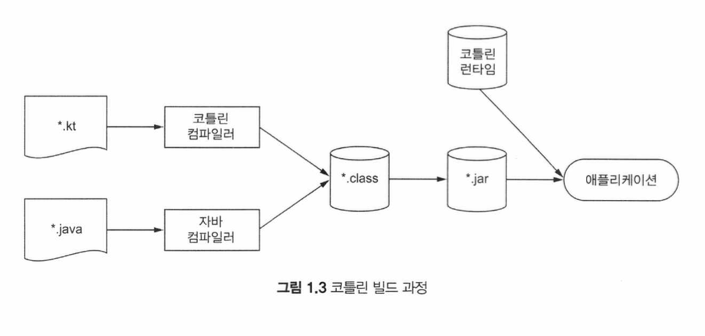

# 01장 - 코틀린이란 무엇이며, 왜 필요한가? (p.37 - p.74)

- 코틀린은 다중 패러다임 언어이자 타입 추론을 지원하는 정적 타입 지정 (statically typed) 언어
- 객채지향과 함수형 프로그래밍을 모두 지원하고, 일급 객체를 통해 고수준의 추상화가 가능함
- 주로 안드로이드 디바이스와 서버 환경에서 사용되지만, 자바가 실행되는 모든 곳에서 사용될 수 있으며 크로스 플랫폼 애플리케이션 제작에도 사용될 수 있음
  - 코틀린을 자바스크립트로 컴파일 가능
  - 코틀린/네이티브를 사용하여 코틀린 코드를 이진 코드로 컴파일 가능하며, 이를 통해 iOS 나 다른 플랫폼에서 스스로 실행되는 프로그램을 만들 수 있음.
  - 개발중인 코틀린/와즘 (Wasm) 을 사용하면 코틀린 코드를 웹어셈블리 바이너리 방식으로 컴파일 가능함.

## 함수형 프로그래밍의 핵심 개념

함수형 프로그래밍의 핵심 개념:

- 일급 객체 (First-class citizen function):
  - 함수를 일반 값처럼 다룰 수 있음.
- 불변성 (immuability):
  - 일단 만들어지고 나면 내부 상태가 절대로 바뀌지 않는 불변 객체를 사용해 프로그램을 작성함
- 부수 효과 (side effect) 없음:
  - 함수형 프로그래밍에서는 입력이 같으면 하상 같은 출력을 내놓고 다른 객체의 상태를 변경하지 않으며, 함수 외부나 다른 바깥 환경과 상호작용하지 않는 순수 함수 (pure function) 을 사용함. 이는 간결하고, 더 강력한 추상화를 가능케 함.

## 코루틴 (Coroutine)

코틀린은 동시성과 비동기 프로그래밍의 문제를 코루틴 (coroutine) 이라 불리는 일시 중단 가능한 계산 (suspendable computation) 을 사용헤 접근함.
코루틴에서는 코드가 자신의 실행을 잠시 중단시킬 수 있고, 나중에 (중단했던 지점부터) 작업을 계속 수행할 수 있음.

## 코틀린의 철학

- **코틀린은 실용적인 언어다**
- **코틀린은 간결하다**
- **코틀린은 안전하다**
- **코틀린은 상호운영성 (interpoerability) 이 좋다**

## 코틀린 코드 컴파일

코틀린은 컴파일 언어이므로, 코틀린 코드를 실행하기 위해서는 반드시 코드를 컴파일해야 함.
코틀린 컴파일러에게는 생성된 JVM 바이트코드가 JVM 에서 실행될지, 혹은 더 변환된 후 안드로이드에서 실행될지는 중요하지 않음.
안드로이드 런타임 (ART - Android RunTime) 은 JVM 바이트코드를 Dex 바이트코드로 변환하고, JVM 바이트코드 대신 Dex 바이트코드를 실행한다.

### 코틀린/JVM에서의 컴파일 과정

- 코틀린 소스코드는 `.kt` 확장자를 가짐
- 코틀린 컴파일러는 소스코드를 분석해서 `.class` 파일을 만듬

```bash
> kotlinc <소스파일 또는 디렉토리> -include-runtime -d <jar 이름>
> java -jar <jar 이름>
```

자바 가상머신은 원본 코드가 코틀린이나 자바 중 어느 언어로 작성됐는지는 알지 못해도, 코틀린 코드에서 빌드된 `.class` 파일을 싫행 가능.
하지만 코틀린 내장 클래스와 API 는 의존관계로, 코틀린 런타임 라이브러리 (Kotlin runtime library) 라는 추가 정보가 필요함.
커맨드라인에서 코드를 컴파일 할 시, 명시적으로 `-include-runtime` 을 호출해 결과로 생기는 JAR 파일 안에 런타임 라이브러리를 포함시켜야 함.



## 요약

- 코틀린은 타입 추론을 지원하는 정적 타입 지정 언어
  - 소스코드의 정확성과 성능을 보장하면서도 소스코드를 간결하게 유지할 수 있음
- 코틀린은 객체지향과 함수형 프로그래밍 스타일을 모두 지원.
  - 코틀린 에서는 일급 시민 함수를 사용해 수준 높은 추상화가 가능하고 불변 값 지원 을 통해 다중 스레드 애플리케이션 개발과 테스트를 더 쉽게 할 수 있음.
- 코루틴은 스레드에 대한 대안으로, 경량이다.

# 내 생각

- 코틀린이 깔끔하고 좋은 언어인갑다
