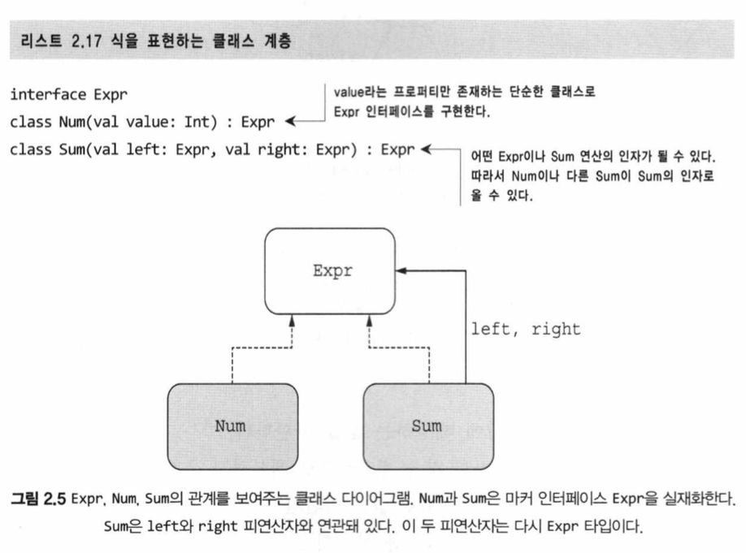
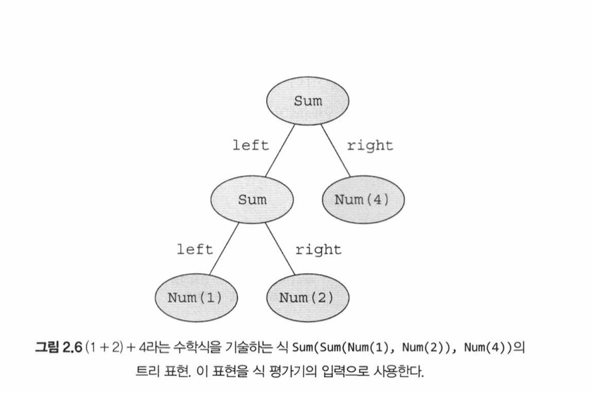

# 02장 - 코틀린 기초 (p.75 - p.128)

## 함수와 변수

- 최상위에 있는 `main` 함수를 애플리케이션의 진입점으로 지정할 수 있음.
  - `main` 인 인자가 없는 함수로 선언될 수도 있고, 문자열 배열이 파라미터 (`args: Array<String>`) 인 함수로 선언될 수도 있음.
  - `args: Array<String>` 는 애플리케이션에게 전달된 각각의 커맨드란 인자에 대응
  - `main` 은 아무 값도 반환하지 않음

### 문 (statement) 과 식 (expression) 의 구분

- 문은 자신을 둘러싸고 있는 가장 안쪽 블록의 최상위 요소로 존재하며 아무런 값을 만들어내지 않음
- 식은 값을 만들어내며, 다른 식의 하위 요소로 계산에 참여할 수 있음

아래의 코드는 올바른 코틀린 코드:

```kotlin
val x = if (myBoolean) 3 else 5
val direction = when (inputString) {
  "u" -> UP
  "d" -> DOWN
  else -> UNKNOWN
}
val number = try {
  inputString.toInt()
} catch (nfe: NumberFormatException) {
  -1
}
```

- 코틀린에서 대입이 항상 문으로 취급됨.
  - 이는 값을 변수에 대입해도, 그 대입 연산 자체는 아무것도 돌려주지 않는다는 뜻.

```kotlin
// 블록 본문 함수 (block body function)
fun max(a: Int, b: Int): Int {
  return if (a > b) a else b
}

// 식 본문 함수 (expression body function)
fun max(a: Int, b: Int): Int = if (a > b) a else b
```

- 식 본문 함수의 반환 타입은 생략할 수 있음
  - 컴파일러가 함수 본문 식을 분석해서 식의 결과 타입을 함수 반환 타입으로 정해줌 (타입 추론 - type inference)

### 변수의 표시

언제 변수에 새 값을 대입할 수 있는지 제어하기 위해 코틀린에서는 변수 선언 시 `val` 과 `var` 를 사용.

- `val` 은 읽기 전용 참조 (read-only reference) 를 선언함.
  - 단 한 번만 대입될 수 있음. 초기화 이후 다른 값을 대입할 수 없음. (Java 에서는 final 변경자를 통해 표현 가능)
- `var` 은 재대입 가능한 참조 (reassignable reference) 를 선언함.

기본적으로, 코틀린에서 모든 변수를 `val` 키워드를 사용해 선언하는 방식을 지켜야 함.
반드시 필요할 때만 변수를 `var` 로 변경함.

`val` 변수는 그 변수가 정의된 블록을 실행할 때 정확히 한 번만 초기화돼야 함.
하지만, 어떤 블록이 실행될 때 오직 한 초기화 문장만 실행됨을 컴파일러가 확인할 수 있다면, 조건에 따라 `val` 값을 다른 여러 값으로 초기화할 수도 있음.

```kotlin
fun canPerformOperation(): Boolean {
  return true
}

fun main() {
  val result: String
  if (canPerformOperation()) {
    result = "Success"
  }
  else {
    result = "Can't perform operation"
  }
}
```

위 코드에서, 컴파일러가 잠재적인 2가지 대입 중 단 하나만 실행될 수 있다는 사실을 알 만큼 똑똑하기 때문에, 여전히 `val` 키워드를 사용해 result 를 읽기 전용 참조로 지정할 수 있음.

`val` 참조 자체가 읽기 전용이어서 한 번 대입된 다음에 그 값을 바꿀 수 없더라도 그 참조가 가리키는 객체의 내부 값은 변경될 수 있음.

- 예를 들어, 아래와 같이 읽기 전용 참조가 가리키는 가변 리스트에 원소를 추가하는 것은 올바른 코틀린 코드임.

```kotlin
fun main() {
  val languages = mutableListOf("Java")
  languages.add("Kotlin")
}
```

`var` 키워드를 사용하면 변수의 값을 지정할 수 있지만, 변수의 타입은 고정됨.

- 예를 들어, 아래 코드에서 해당 타입 (String) 이 컴파일러가 기대하는 타입 (Int) 와 다르기 때문에 컴파일 오류가 발생함.

```kotlin
fun main() {
  val answer = 42
  answer = "no answer" // Error: type mismatch 컴파일 오류 발생
}
```

컴파일러는 변수 선언 시점의 초기화 식으로부터 변수의 타입을 추론하며, 변수 선언 이후 변수 재대입이 이뤄질 때는 이미 추론한 변수의 타입을 염두에 두고 대입문의 타입을 검사함.

어떤 타입의 변수에 다른 타입의 값을 저장하고 싶다면, 변환 함수를 써서 값을 변수의 타입으로 변환하거나, 값을 변수에 대입할 수 있는 타입으로 강제 형 변환 (coerce) 해야 함.

### 문자열 템플릿

```kotlin
fun main() {
  val input = readln()
  val name = if (input.isNotBlank()) input else "Kotlin"
  println("Hello, $name!")
}
```

- JVM 1.8 타깃의 경우, 컴파일된 코드는 `StringBuilder` 를 사용하고, 상수 부분과 변수 값을 이 `StringBuilder` 에 덧붙임.
- JVM 9 나 그 이상의 버전을 타깃으로 하는 애플리션에서는 `invokedynamic` 을 사용해 문자열 연결이 더 효율적으로 컴파일 됨.

- 코틀린에서는 글자 (letter) 카테고리로 분류할 수 있는 모든 유니코드 문자를 식별자에 사용할 수 있음.

## 행동과 데이터 캡술화: 클래스와 프로퍼티

```kotlin
/* Java */
public class Person {
  private final String name;

  public Person(String name) {
    this.name = name;
  }

  public String getName() {
    return name;
  }
}

/* Kotlin */
class Person (val name:String)
```

위 두 클래스는 같은 의미를 가지는 Person 클래스이다.

- 자바를 코틀린으로 변환하면서, `public` 가시성 지정자 (visibility modifier) 가 사라졌음에 유의.
- 코틀린의 기본 가시성은 `public` 이므로, 이 경우 지정자를 생략할 수 있음.

### 클래스와 데이터를 연관시키고, 접근 가능하게 만들기: 프로퍼티

#### 클래스

- 클래스라는 개념은 데이터를 캡슐화하고 캡슐화한 데이터를 다루는 코드의 한 주체 안에 가두는 것.
- 자바에서는 데이터를 필드에 저장하며 멤버 필드의 가시성은 보통 비공개 (`private`) 임.
- 클라이언트가 클래스의 필드에 접근해야 할 필요가 있으면 접근자 메서드 (accessor method) 를 제공함.
- 접근자 메서드에는 게터 (getter) 가 있고 세터 (setter) 도 있을 수 있음.
  - 세터는 자신이 받은 값을 검증하거나 필드 변경을 다른 곳에 통지하는 등의 로직을 더 포함할 수 있음.

#### 프로퍼티

- 자바에서는 필드와 접근자를 한데 묶어 프로퍼티 (property) 라고 부르며, 프로퍼티 개념을 활용한 프레임워크가 많음.
- 코틀린은 프로퍼티를 언어 기본 기능으로 제공하며, 코틀린 프로퍼티는 자바의 필드와 접근자 메서드를 완전히 대신함.
- 클래스에서 프로퍼티를 선언할 때는 앞에서 본 변수를 선언하는 방법과 마찬가지로 `val` 이나 `var` 을 사용함.

```kotlin
class Person(
  val name: String, // 읽기 전용 프로퍼티. 코틀린은 (비공개) 필드와 필드를 읽는 단순한 (공개) 게터를 만들어냄.
  var isStudent: Boolean // 쓸 수 있는 프로퍼티. 코틀린은 (비공개) 필드, (공개) 게터, (공개) 세터를 만들어냄.
)
```

- 기본적으로, 코틀린에서 프로퍼티를 선언하는 방식은 프로퍼티와 관련 있는 접근자를 선언하는 것.
  - 읽기 전용 프로퍼티 - 게터만 선언
  - 변경 가능한 프로퍼티 - 게터와 세터를 모두 선언

```java
public class Demo {
  public static void main(String[] args) {
    Person person = new Person("Bob", true);
    System.out.println(person.getName());
    // Bob
    System.out.println(person.isStudent());
    // true
    person.setStudent(false) // 졸업!
    System.out.println(person.isStudent());
    // false
  }
}
```

- 코틀린의 `name` 프로퍼티는 자바 측에게 `getName` 이라는 이름으로 노출됨.
- 게터와 세터 이름 규칙의 예외:
  - 이름이 `is` 로 시작하는 프로퍼티의 게터에는 `get` 이 붙지 않고 원래 이름ㅁ을 그대로 사용하며, 세터에는 `is` 를 `set` 으로 바꾼 이름을 사용함.
  - 따라서 자바에서 `isStudent` 프로퍼티에 접근할 때는 `isStudent()` 와 `setStudent()` 를 사용해야 함

```kotlin
fun main() {
  val person = Person("Bob", true) // new 키워드를 사용하지 않고 생성자를 호출함
  println(person.name) // 프로퍼티 이름을 직접 사용해도 코틀린이 자동으로 게터를 호출함
  // Bob
  println(person.isStudent)
  // true
  person.isStudent = false // 프로퍼티 이름을 직접 사용해도 코틀린이 자동으로 세터를 호출함
  println(person.isStudent)
  // false
}
```

#### 프로퍼티 값을 저장하지 않고 계산: 커스텀 접근자

```kotlin
class Rectangle(val height: Int, val width: Int) {
  val isSquare: Boolean
    get {
      return height == width
    }
}
```

## 패키지 (package)

```kotlin
package geometry.example

import geometry.shapes.Rectangle
import geometry.shapes.createUnitsquare

fun main() {
  println(Rectangle(3, 4).isSquare)
  // false
  println(createunitsquare().isSquare)
  // true
}
```

- 코틀린은 클래스를 조직화하기 위해 패키지라는 개념을 사용.
- 같은 패키지에 속해 있다면 다른 파일에서 정의한 선언일지라도 직접 사용 가능.
- 다른 패키지에 정의한 선언을 사용하려면 해당 선언을 `import` 로 불러와야 함.

## 선택 표현과 처리: 이넘 (Enum) 과 when

### Enum

- `enum` 은 소프트 키워드

```kotlin
package ch02.colors

enum class Color {
  RED, ORANGE, YELLOW, GREEN, BLUE, INDIGO, VIOLET
}
```

```kotlin
package ch02.colors

enum class Color(
  val r: Int,
  val g: Int,
  val b: Int
) {
  RED(255, 0, 0),
  ORANGE(255, 165, 0),
  YELLOW(255, 255, 0),
  GREEN(0, 255, 0),
  BLUE(0, 0, 255),
  INDIGO(75, 0, 130),
  VIOLET(238, 130, 238); // 세미콜론 필수!

  fun rgb() = (r * 256 + g) * 256 + b
  fun printColor() = println("$this is $rgb")
}

fun main() {
  println(Color.BLUE.rgb)
  // 255
  Color.GREEN.printColor()
  // GREEN is 65280
}
```

### `when`

- `if` 와 마찬가지로, `when` 도 값을 만들어내는 식.

```kotlin
fun getMnemonic(color: Color) = // 함수의 반환값으로 when 식을 직접 사용
  when (color) {
    Color.RED -> "Richard"
    Color.ORANGE -> "Of"
    Color.YELLOW -> "York"
    Color.GREEN -> "Gave"
    Color.BLUE -> "Battle"
    Color.INDIGO -> "In"
    Color.VIOLET -> "Vain"
}

fun main() {
  println(getMnemonic(Color. BLUE))
 // Battle
}
```

### `when` 식의 대상을 변수에 캡처

```kotlin
import ch02.colors.Color.*

fun measureColor() = ORANGE

fun getWarmthFromSensor() =
  when (val color = measureColor()) {
    RED, ORANGE, YELLOW -> "warm (red = ${color.r})"
    GREEN -> "neutral (green = ${color.g})"
    BLUE, INDIGO, VIOLET -> "cold (blue = ${color.b})"
  }
```

- 위 코드에서는 `when` 의 대상을 when 식의 본문으로 영역이 제한되는 변수에 저장함.

### `when` 의 분기 조건에 임의의 객체 사용

```kotlin
fun mix(c1: Color, c2: Color) =
  when (setOf(c1, c2)) {
    setOf(RED, YELLOW) -> ORANGE
    setOf(YELLOW, BLUE) -> GREEN
    setOf(BLUE, VIOLET) -> INDIGO
    else -> throw Exception("Dirty color")
  }

fun main() {
  println(mix(BLUE, YELLOW))
  // GREEN
}
```

- 위 코드에서, 모든 가능한 색상의 집합을 처리하는지 코틀린 컴파일러가 연역할 수 없고, `when` 식의 값을 `mix` 함수의 반환값으로 사용하기 때문에, 디폴트 케이스를 제공해 `when` 식을 철저하게 만들어야 함.

### 인자 없는 `when` 사용

- `when` 에 아무 인자도 없으려면, 각 분기의 조건이 `Boolean` 결과를 계산하는 식이어야 함.

## 스마트 캐스트: 타입 검사와 타입 캐스트 조합




### `is`

- C# 의 `instanceof` 와 비슷하지만, 추가적인 편의를 제공함.
  - 어떤 변수의 타입을 확인한 다음, 그 타입에 속한 멤버에 접근하기 위해 명시적으로 변수 타입을 반환하지 않아도 됨.
  - 실제로는, 컴파일러가 타입을 대신 변환해 줌. (= 스마트 캐스트)

### `as`

- 원하는 타입으로 명시적으로 타입 캐스팅하려면 `as` 키워드를 사용함

```kotlin
val n = e as Num
```

## 대상 이터레이션: `while` 과 `for` 루프

### `while`

- 내포된 루프의 경우 코틀린에서는 레이블 (label) 을 지정할 수 있음.
- 이후 `break` 나 `continue` 를 사용할 때 레이블을 참조할 수 있음.
  - 레이블은 @ 기호 다음에 식별자를 붙인 것.

```java
outer@ while (outerCondition) {     // 바깥 루프에 outer 라는 레이블을 붙임
  while (innerCondition) {          // 레이블을 지정하지 않으면 항상 그 위치를 둘러싼 가장 안쪽 루프에 대해 동작이 이루어짐
    if (shouldExitInner) break
    if (shouldSkipInner) continue
    if (shouldExit) break@outer     // 레이블을 지정하면 지정한 루프를 빠져나가거나 할 수 있음.
    if (shouldSkip) continue@outer
    // ..
  }
  // ..
}
```

### 수에 대한 이터레이션: 범위와 순열

- 범위는 기본적으로 두 값으로 이뤄진 구간 (interval)
- `..` 연산자를 사용

```kotlin
val oneToTen = 1..10
```

```kotlin
fun fizzBuzz(i: Int) = when {
  i % 15 == 0 -> "피즈버즈 "
  i % 3 == 0 -> "피즈 "
  i % 5 == 0 -＞ "버즈 "
  else -> "$i "
}
fun main() {
  for (i in 1..100) {
    print(fizzBuzz(i))
  }
  // 1 2 피즈 4 버즈 피즈 7. ..
}
```

- `..` 는 항상 범위의 끝 값을 포함
- 끝 값을 포함하지 않는 반만 닫힌 범위 (half-closed range) 를 만들고 싶으면, `..<` 연산을 사용.
- `for (x in 0..<size)` 는 `for (x in 0..size-1)` 과 같지만 더 명확함.

### 맵에 대한 이터레이션

```kotlin
fun main() {
  val binaryReps = mutableMapOf<Char, String>() // 코튤린 가변 맵은 원소 이터레이션 순서를 보존한다
  for (char in 'A'..'F') { // A부터 F까지 문자의 범위튤 사용해 이터레이션한다．
    val binary = char.code.toString(radix = 2) // 아스키 (ASCII) 코드를 2진 표현으로 바꾼다．
    binaryReps[char] = binary // c튤 키로 c의 2진 표현을 맵에 넣는다．
  }

  for ((letter, binary) in binaryReps) { // 맵에 대해 이터레이션한다． 맵의 키를 letter 에, 키와 연관된 값을 binary에 대입한다．
  println("$letter = $binary")
  }
  // A = 1000001 D = 1000100
  // B = 1000010 E = 1000101
  // C = 1000011 F = 1000110
  // （이해하기 쉽게 출력을 여러 열로 표시했다）
}
```

### `in` 으로 컬렉션이나 범위의 원소 검사

```kotlin
fun isLetter(c: Char) = c in 'a'..'z' || c in 'A'..'Z'
fun isNotDigit(c: Char) = c !in '0'..'9'
```

```kotlin
fun main() {
  println("Kotlin" in "Java".."Scala") // "Java" <= Kotlin" && "Kotlin" <= "Scala" 와 같음.
  // true
}
```

## 코틀린에서 예외 던지고 잡아내기

- `try` 는 (`if` 와 `when` 과 마찬가지로) 식이기도 함.

## 요약

- 함수는 `fun` 키워드로 정의
- `val` 읽기 전용 변수
- `var` 변경 가능한 변수
- `val` 참조는 읽기 전용이지만, `val` 참조가 가리키는 객체의 내부 상태는 여전히 변경 가능할 수 있음
- `if` 는 식 (expression) 이며, 값을 만들어냄
- `when` 은 `switch` 와 비슷하지만 더 강력함
- 어떤 변수의 타입을 검사하고 나면, 그 변수를 캐스팅하지 않아도 검사한 타입의 변수처럼 사용할 수 있음.
  - 컴파일러가 스마트 캐스트를 활용해 자동으로 타입을 바꿔줌
- `1..5` (혹은 `1..<5`) 와 같은 식은 범위 (range) 를 만들어냄

# 내 생각

- 코틀린 문법 당뇨병 올것같아 너무 좋아
