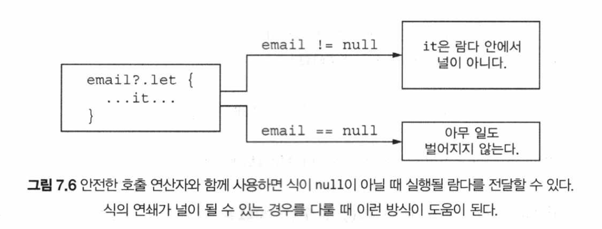
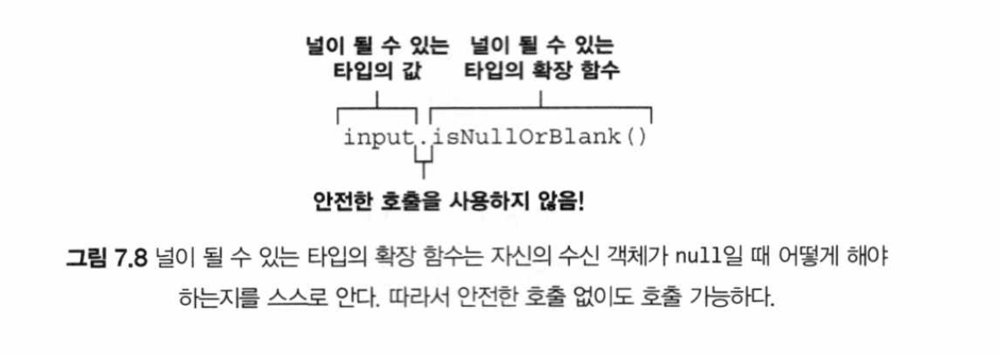

# 07장 - (p.313 - p.348)

## 널 가능성

- 코틀린 (과 최신 언어들) 에서 `null` 에 대한 접근 방법은, 가능한 `null` 문제를 실행 시점에서 컴파일 시점으로 옮기는 것

## `null`이 될 수 있는 타입으로 `null`이 될 수 있는 변수 명시

```kotlin
fun strLen(s: String) = s.length
// null 이 될 수 있는 값을 strLen 에 인자로 넘길 수 없음

fun strLenSafe(s: String?) = ...
// 있음
```

- 타입 뒤에 명시적으로 `?` 가 붙어야 `null` 이 될 수 있음

```kotlin
fun main() {
  val x: String? = null
  val y: String = x
  // ERROR: Type mismatch:
  // inferred type is String? but String was expected
}
```

- 널이 될 수 있는 타입의 값으로 대체 뭘 할 수 있을까?
  - `null` 과 비교할 수 있다 (당연하다)
  - 일단 `null` 과 비교하고 나면 컴파일러는 그 사실을 기억하고 `null` 이 아님이 확실한 영역에서는 해당 값을 `null` 이 아닌 타입의 값처럼 사용할 수 있음

```kotlin
fun strLenSafe(s: String?): Int =
  if (s != null) s.length else 0
  // null 검사를 추가하면 코드가 컴파일됨
```

## 타입의 의미

> 타입: 가능한 값의 집합과 그런 값들에 대해 수행할 수 있는 연산의 집합
> \-David Parnas

- 실행 시점에 null 이 될 수 있는 타입이나 null 이 아닌 타입의 객체는 같음
  - 널이 될 수 있는 타입은 널이 아닌 타입을 감싼 래퍼 타입이 아님
  - 실행 시점 성능에 영향을 끼치는 몇 가지 근본적인 검사를 제외하면, 널이 될 수 있는 타입을 처리하는 데 근본적으로 아무런 실행 시점 부가 비용이 들지 않음

## `null` 검사와 메서드 호출 합치기: `?.`

```kotlin
str?.uppercase()
// 위 코드는 아래의 if-else 문과 같다

if (str != null)
	str.uppercase()
else
	null
```

- 안전한 호출의 결과 타입도 널이 될 수 있는 타입이라는 점을 유의
- `String.uppercase` 는 `String` 타입을 반환하지만, `s` 가 `null` 이 될 수 있는 타입인 경우 `str.uppercase()` 식의 결과 타입은 `String?` 임

- 메서드 호출뿐 아니라, 프로퍼티를 읽거나 쓸 때도 안전한 호출을 사용할 수 있음

```kotlin
class Employee(val name: String, val manager: Employee?)

fun managerName(employee: Employee): String? = employee.manager?.name

fun main() {
  val ceo = Employee("Da Boss", null)
  val developer = Employee("Bob Smith", ceo)
  println(managerName(developer))
  // Da Boss
  println(managerName(ceo))
  // null
}
```

- null 이 될 수 있는 프로퍼티를 다루기 위해 안전한 호출 사용

```kotlin
class Address(val streetAddress: String, val zipCode: Int, val city: String, val country: String)

class Company(val name: String, val address: Address?)

class Person(val name: String, val company: Company?)

fun Person.countryName(): String {
  val country = this.company?.address?.country
  return if (country != null) country else "Unknown"
}

fun main() {
  val person = Person("Dmitry", null)
  println(person.countryName())
  // Unknown
}
```

## 엘비스 연산자로 `null` 에 대한 기본값 제공 `?:`

- 엘비스 (elvis) 연산자, 혹은 널 복합 (null coalescing) 연산자
  - 시계방향으로 90도 돌리면 엘비스 프레슬리 특유의 헤어스타일과 눈이 보인다 (재밌다)

```kotlin
fun greet(name: String?) {
  val recipient: String = name ?: "unnamed"
  // name 이 null 이면 결과는 "unnamed"
  println("Hello, $recipient!")
}
```

- 이 연산자는 2가지 값을 받음
  - 첫 번째 값이 null 이 아니면, 그 값이 전체의 결과고
  - 첫 번째 값이 null 이면 두 번째 값이 결과

```kotlin
fun strLenSafe(s: String?): Int = s?.length ?: 0

fun main() {
  println(strLenSafe("abc"))
  // 3
  println(strLenSafe(null))
  // 0
}
```

```kotlin
fun Person.countryName(): String {
  val country = this.company?.address?.country
  return if (country != null) country else "Unknown"
}

fun Person.countryName() = company?.address?.country ?: "Unknown"
```

- 코틀린에서는 `return` 과 `throw` 도 식이기 때문에 엘비스 연산자의 오른쪽에 `return`, `throw` 등을 넣을 수 있어 더욱 편하게 사용 가능
  - 그런 경우, 엘비스 연산자의 왼쪽 값이 `null` 이 되면 함수가 즉시 어떤 값을 반환하거나 예외를 던짐

```kotlin
class Address(val streetAddress: String, val zipCode: Int, val city: String, val country: String)

class Company(val name: String, val address: Address?)

class Person(val name: String, val company: Company?)

fun printShippingLabel(person: Person) {
  val address = person.company?.address ?: throw IllegalArgumentException("No Address")
  // 주소가 없으면 예외 발생
  with (address) {
    println(streetAddress)
    println("$zipCode $city, $country")
  }
}

fun main() {
  val address = Address("Elsestr. 47", 80687, "Munich", "Germany")
  val jetbrains = Conipany("JetBrains", address)
  val person = Person("Dmitry", jetbrains)

  printShippingLabel (person)
  // Elsestr. 47
  // 80687 Munich, Germany

  printShippingLabel(Person("Alexey", null))
  // java.lang.IllegalArgumentException: No address
}
```

- `printShippingLabel` 함수는 모든 정보가 제대로 있으면 주소를 출력함
  - 주소가 없으면 그냥 NullPointerException 을 던지는 대신에 의미 있는 오류 발생

## 안전한 캐스트 연산자: `as?`

- `as?` 연산자는 어떤 값을 지정한 타입으로 변환함
- `as?` 는 값을 대상 타입으로 변환할 수 없으면 `null` 을 반환함

- 안전한 캐스트를 사용할 때 일반적인 패턴은 캐스트를 수행한 뒤에 엘비스 연산자를 사용하는 것

```kotlin
class Person(val firstName: String, val lastName: String) {
  override fun eauals(o: Anvfl: Boolean {
		val otberPerson = o as? Person ? : return false
		// 타입이 서로 일치하지 않으면 false 반환

	return otherPerson.firstName == firstName && otherPerson.lastName == lastName
	// 안전한 캐스트를 하고 나면, otherPerson 이 Person 타입으로 스마트 캐스트 됨
	}

	override fun hashCode(): Int = firstName.hashCode() * 37 + lastName.hashCode()
}

fun main() {
  val p1 = Person("Dmitry", "Jemerov")
  val p2 = Person("Dmitry", "Jemerov")
  println(p1 == null)
  // false
  println(p1 == p2)
  // true
  println(p1.equals(42))
  // false
}
```

- 안전한 연산자를 사용해 equals 를 구현할 시, 캐스트를 수행한 뒤에 엘비스 연산자를 사용하는 패턴이 유용함
- 이 패턴을 사용할 경우, 파라미터로 받은 값이 원하는 타입인지 쉽게 검사하고 캐스트 할 수 있음
  - 타입이 맞지 않으면 false 반환
  - 이 모든 동작을 하나의 식으로 해결할 수 있음
  - 타입을 검사하고, null 값을 거부하고 나면 컴파일러가 otherPerson 변수의 값이 Person 이라는 사실을 알고 적절히 처리해줄 수 있음

## 널 아님 단언 (not-null assertion): `!!`

- 직접 컴파일러에게 어떤 값이 실제로는 `null` 이 아니라는 사실을 알려주고 싶을 때 사용
- `!!` 을 사용하면, 어떤 값이던 널이 아닌 타입으로 (강제로) 바꿀 수 있음
- 실제 `null` 에 대해 `!!` 를 사용하면, `NullPointerException` 이 발생

- `!!` 를 `null` 에 대해 사용해서 발생하는 예외의 스택 트레이스에는 어떤 파일의 몇 번째 줄인지에 대한 정보는 들어있지만, 어떤 식에서 예외가 발생했는지에 대한 정보는 들어있지 않음
  - 어떤 값이 `null` 이었는지 확실하게 하기 위해, 여러 `!!` 단언문을 한 줄에 함께 쓰는 일을 피하면 가장 좋음

## `let` 함수

- `let` 함수를 사용하면 `null` 이 될 수 있는 식을 더 쉽게 다룰 수 있음
- `let` 을 안전한 호출 연산자와 함께 사용하면, 원하는 식을 평가해서 결과가 `null` 인지까지 검사한 다음에 그 결과를 변수에 넣는 작업을 간단하게 처리할 수 있음
- `let` 을 사용하는 가장 흔한 용례는, `null` 이 될 수 있는 값을 `null` 이 아닌 값만 인자로 받는 함수에 넘기는 경우

```kotlin
fun sendEmailTo(email: String) { /* ... */ }

fun main() {
  val email: String? = "foo@bar.com"
  sendEmailTo(email)
  // ERROR: Type mismatch: inferred type is String? but String was expected
}
```

- 인자를 넘기기 전에 주어진 값이 null 이 아닌지 검사해야 함

```kotlin
if (email ! = null) sendEmailTo(email)
```

- 하지만 `let` 함수를 통해 인자를 전달할 수도 있음
  - `let` 함수는 자신의 수신 객쳬를 인자로 전달받은 람다에 넘김
  - 널이 될 수 있는 값에 대해 안전한 호출 구문을 사용해 `let`을 호출하되, 널이 아닌 타입을 인자로 받는 람다를 `let`에 전달함
  - 이렇게 하면 널이 될 수 있는 타입의 값을 널이 될 수 없는 타입의 값으로 바꿔 람다에 전달하게 됨



- `let` 함수는 이메일 주소 값이 `null` 이 아닌 경우에만 호출됨
  - 따라서 다음 예제의 람다 안에서는 `null` 이 아닌 타입으로 email 을 사용할 수 있음

```kotlin
email?.let { email -> sendEmailTo(email) }
```

- 아주 긴 식이 있고 그 값이 `null`이 아닐 때 수행해야 하는 로직이 있을 때, `let` 을 쓰면 훨씬 더 편함

  - `let`을 쓰면 긴 식의 결과를 저장하는 변수를 따로 만들 필요가 없음

- 다음의 명시적인 `if` 검사와

```kotlin
val person: Person? = getTheBestPersonlnlheworld()
if (person != null) sendEmailTo(person.email)
```

- 별도의 변수를 사용하지 않는 다음 식을 비교해보자

```kotlin
getlheBestPersonlnlheworld()?.let { sendEmailTo(it.email)}
```

- 다음 `getTheBestpersonlnlheWorld()` 함수는 `null`을 반환함
  - 따라서 위의 람다식은 결코 실행되지 않음

```kotlin
fun getlheBestPersonlnTheworld(): Person? = null
```

- 여러 값이 `null`인지 검사해야 한다면, `let` 호출을 내포시켜 처리할 수 있음
  - `let`을 내포시켜 처리하면 코드가 복잡해져서 알아보기 어려워짐
  - 그런 경우 일반적인 `if`를 사용해 모든 값을 한꺼번에 검사하는 펀이 나음


## 직접 초기화하지 않는 `null` 이 아닌 타입: 지연 초기화 프로퍼티

- 코틀린에서는 일반적으로 생성자에서 모든 프로퍼티를 초기화해야 함

  - 게다가 프로퍼티 타입이 `null`이 될 수 없는 타입이라면, 반드시 `null`이 아닌 값으로 해당 프로퍼티를 초기화해야 함
  - 그런 초기화 값을 제공할 수 없다면, `null`이 될 수 있는 타입을 사용할 수 밖에 없음
  - 하지만 `null`이 될 수 있는 타입을 사용하면, 모든 프로퍼티 접근에 `null` 검사를 넣거나 `!!` 연산자를 사용해야 함

- 이를 해결하기 위해, 프로퍼티를 지연 초기화 (late-initialize) 할 수 있음
- `lateinit` 변경자를 붙이면 프로퍼티를 나중에 초기화할 수 있음

```kotlin
class MyService {
  fun performActionQ: String = "Action Done!"
}

@TestInstance(TestInstance.Lifecycle.PER_CLASS)
class Mylest {
  private lateinit var myService: MyService
  // 초기화하지 않고 널이 아닌 프로퍼티를 선언

  @BeforeAll fun setUp() {
    myService = MyService()
    // setUp 메서드에서 프로퍼티를 초기화
  }

  @Test fun testAction() {
    assertEquals("Action Done!", myService.performAction())
    // null 검사를 수행하지 않고 프로퍼티를 사용함
}
```

- 생성자 밖에서 값을 바꿔야 하는데, `val` 프로퍼티는 파이널 필드로 컴파일되며 생성자 안에서 반드시 초기화돼야 하기 때문에 지연 초기화 프로퍼티는 항상 `var` 여야 한다는 점에 유의


- 지연 초기화 프로퍼티가 `public` 이라면 코틀린이 생성한 필드도 `public` 임

## 안전한 호출 연산자 없이 타입 확장: 널이 될 수 있는 타입에 대한 확장

- 널이 될 수 있는 타입에 대한 확장 함수를 정의하면, `null` 값을 다루는 강력한 도구 로 활용할 수 있음

  - 어떤 메서드를 호출하기 전에 수신 객체 역할을 하는 변수가 `null`이 될 수 없다고 보장하는 대신, 메서드 호출이 `null`을 수신 객쳬로 받고 내부에서 `null`을 처리하게 할 수 있음
  - 이런 치리는 확장 함수에서만 가능함
  - 멤버 호출은 객체 인스턴스를 통해 디스패치 (dispatch) 되므로, 그 인스턴스가 `null`인지 여부를 검사하지 않음

- 예를 들어, `isEmptyOrNull` 나 `isBlankOrNull` 가 있음



- `isNullOrBiank`는 `null`을 명시적으로 검사해서 `null`인 경우 `true`를 반환하고 , `null`이 아닌 경우 `isBlank`를 호출함

  - 이때 `isBlank`는 널이 아닌 문자열 타입의 값에 대해서만 호출될 수 있음

- `null`이 될 수 있는 타입 (그런 타입은 ？로 끝남) 에 대한 확장을 정의하면, `null` 이 될 수 있는 값에 대해 그 확장 함수를 호출할 수 있음

  - 그 함수의 내부에서 `this`는 `null`이 될 수 있음
  - 따라서 명시적으로 `null` 여부를 검사해야 함
  - 자바에서는 메서드 안의 `this` 는 그 메서드가 호출된 수신 객쳬를 가리키므로, 항상 `null`이 아님
  - 코틀린에서는 `null`이 될 수 있는 타입의 확장 함수 안에서는, `this` 가 `null` 될 수 있다는 점이 자바와 다름

- 앞에서 살펴본 `let` 함수도 널이 될 수 있는 타입의 값에 대해 호출할 수 있지만, `let`은 `this`가 `null`인지 검사하지 않음
  - 널이 될 수 있는 타입의 값에 대해 안전한 호출을 사용하지 않고 `let`을 호출하면, 람다의 인자는 널이 될 수 있는 타입으로 추론됨
  - 이는 값이 `null`인지 여부와 관계없이 람다가 호출된다는 의미

```kotlin
fun sendEmaillo(email: String) {
  println('Sending email to $ema11')
}

fun main() {
  val recipient: String? = null
  recipient.let { sendEmailTo(it) }
  // 안전한 호출을 하지 않음
  // 따라서 it 은 null 이 될 수 있는 타입으로 취급됨
  // ERROR: Type mismatch:
  // inferred type is String? but String was expected
}
```

- 따라서 `let`을 사용할 때 수신 객체가 `null`이 아닌지 검사하고 싶다면, `recipient?.let { sendEmailTo(it) }`처럼 반드시 안전한 호출 연산인 ?. 를 사용해야 함

- 코틀린에서 `s.isNullOrBlank()`처럼 추가 검사 없이 변수를 참조한다고 해서, `s` 가 널이 될 수 없는 타입이 되는 건 아님
  - `isNullOrBlank()` 가 널이 될 수 있는 타입의 확장 함수라면, `s`가 널이 될 수 있는 타입일 수도 있음

## 타입 파라미터의 널 가능성

- 코틀린에서 함수나 클래스의 모든 타임 파라미터는 기본적으로 null이 될 수 있음

- 따라서 타입 파라미터 T를 클래스나 함수 안에서 타입 이름으로 사용하면, 이름 끝에 물음표가 없더라도 T가 널이 될 수 있는 타입임

```kotlin
fun <T> printHashCode(t: T) {
  println(t?.hashCode())
  // t 가 null 이 될 수 있으므로, 안전한 호출을 사용해야 함
}

fun main() {
  printHashCode(null)
  // T 의 타입은 Any? 로 추론됨
  // null
}
```

- 타입 파라미터가 `null`이 아님을 확실히 하려면, `null`이 될 수 없는 타입 상계 (upper bound) 를 지정해야 함
  - 이렇게 널이 될 수 없는 타입 상계를 지정하면 널이 될 수 있는 값을 거부함

```kotlin
fun <T: Any> printHashCode(t: T) {
  println(t.hashCodeQ)
}

fun main() {
  printHashCode(null)
  // Error: Type parameter bound for `T` is not satisfied
  printHashCode(42)
  // 42
}
```

## 널 가능성과 자바


### 플랫폼 타입

- 코틀린이 `null` 관련 정보를 알 수 없는 타입
  - 해당 타입을 `null` 이 될 수 있는 타입으로 처리해도 되고, `null` 이 될 수 없는 타입으로 처리해도 됨
  - 이는 자바와 마찬가지로, 플랫폼 타입에 대해 수행하는 모든 연산에 대한 책임이 개발자에게 있다는 것

## 요약

- 코틀린은 널이 될 수 있는 타입을 지원해 `NullPointerException` 오류를 컴파일 시점에 감지할 수 있음
- 일반 타입들은 물음표를 붙여 명시적으로 널이 될 수 있는 타입이라고 지정하기 전까지 기본적으로 널이 될 수 없음
  - 타입 이름 뒤의 물음표는 널이 될 수 있음을 표시
- 코틀린은 널이 될 수 있는 타입을 간결하게 다룰 수 있는 다양한 도구롤 제공함
- 안전한 호출 (`?.`) 을 사용하면 널이 될 수 있는 객체의 메서드를 호출하거나 프로퍼티에 접근할 수 있음
- 엘비스 연산자 (`?:`) 를 사용하면 어떤 식이 null일 때 대신할 값을 지정할 수도 있고, 실행을 반환시키거나 예외를 던질 수도 있음
- 널 아님 단언 (`!!`) 은 컴파일러에게 주어진 값이 null이 아니라고 약속하는 것 (하지만 이 약속을 깨는 경우 책임은 여러분에게 있음)
- `let` 영역 함수는 자신이 호출된 수신 객체를 람다에게 전달함
  - 안전한 호출 연산자와 `let`을 함께 사용하면 널이 될 수 있는 타입의 객체를 널이 될 수 없는 타입으로 변환하는 효과가 있음
- `as?` 연산자를 사용하면 값을 다른 타입으로 변환하는 것과 변환이 불가능한 경우를 처리하는 것을 한꺼번에 편리하게 처리할 수 있음

## 문제

### 문제 1

- 두 `List<String>` 을 받아, `null` 이 아닌 문자열만 골라 대문자로 변환 후, 중복을 제거해 오름차순으로 정렬한 새 리스트를 반환하는 함수 `safeMerge` 를 구현하세요.
  - 리스트 자체가 없을 수 있음
  - 내부 요소도 없을 수 있음

```kotlin
fun safeMerge(a: List<String?>?, b: List<String?>?): List<String> {
    // TODO
}
```

### 문제 2

- 아래 코드가 정상적으로 실행된다면, 콘솔에 뭐가 찍힐까요?

```kotlin
data class Node(val name: String, val next: Node? = null)

val tail = Node("Tail")
val head = Node("Head", Node("Middle", tail))

val result = head.next?.next?.next?.name ?: "Reached Null"
println(result)
```
